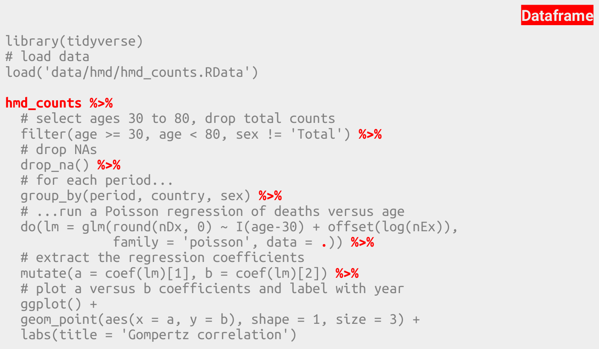
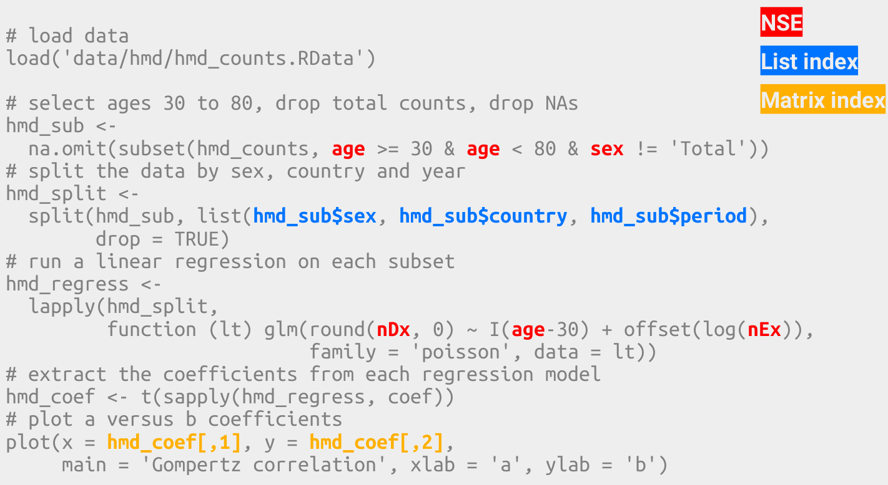
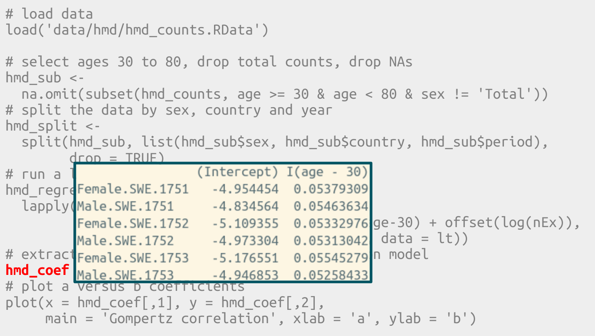
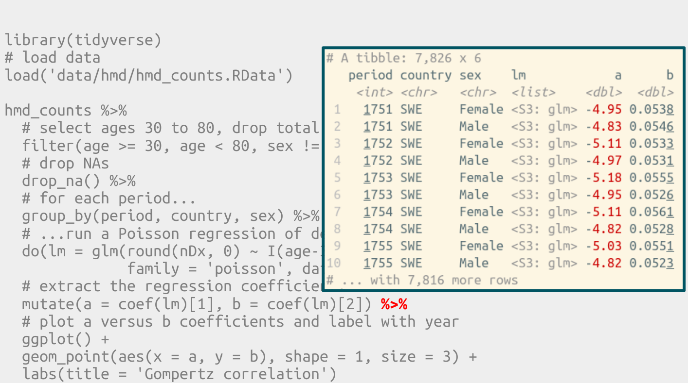

What is tidy R?
===============


Differences between tidy and base R
-----------------------------------

The Gompertz Law describes the exponential relationship between age and mortality rate in human populations. Its two parameters $a$ and $b$ describe the overall mortality level and the relative rate of mortality inrease over age. It is well known that both parameters correlate with each other. The code below demonstrates this co-variance by fitting the Gompertz equation to Swedish birth cohorts and plotting the parameter estimates against each other.

$$
\mu(x) = ae^{bx}
$$


```r
# load data
load('data/hmd/hmd_counts.RData')

# select ages 30 to 80, drop total counts, drop NAs
hmd_sub <-
  na.omit(subset(hmd_counts, age >= 30 & age < 80 & sex != 'Total'))
# split the data by sex, country and year
hmd_split <-
  split(hmd_sub, list(hmd_sub$sex, hmd_sub$country, hmd_sub$period),
        drop = TRUE)
# run a linear regression on each subset
hmd_regress <-
  lapply(hmd_split,
         function (lt) glm(round(nDx, 0) ~ I(age-30) + offset(log(nEx)),
                           family = 'poisson', data = lt))
# extract the coefficients from each regression model
hmd_coef <- t(sapply(hmd_regress, coef))
# plot a versus b coefficients
plot(x = hmd_coef[,1], y = hmd_coef[,2],
     main = 'Gompertz correlation', xlab = 'a', ylab = 'b')
```

<!-- -->

Here's how I would write the same program today, using the `tidyverse`.


```r
library(tidyverse)
# load data
load('data/hmd/hmd_counts.RData')

hmd_counts %>%
  # select ages 30 to 80, drop total counts
  filter(age >= 30, age < 80, sex != 'Total') %>%
  # drop NAs
  drop_na() %>%
  # for each period...
  group_by(period, country, sex) %>%
  # ...run a Poisson regression of deaths versus age
  do(lm = glm(round(nDx, 0) ~ I(age-30) + offset(log(nEx)),
              family = 'poisson', data = .)) %>%
  # extract the regression coefficients
  mutate(a = coef(lm)[1], b = coef(lm)[2]) %>%
  # plot a versus b coefficients and label with year
  ggplot() +
  geom_point(aes(x = a, y = b), shape = 1, size = 3) +
  labs(title = 'Gompertz correlation')
```

<!-- -->

What are the differences?











### Excercise: Differences between tidy and base R

- Discuss the differences.

Literate programming in Rmarkdown
---------------------------------

[The official Rmarkdown cheat sheet.](https://www.rstudio.com/wp-content/uploads/2015/02/rmarkdown-cheatsheet.pdf)

### Excercise: Literate programming in Rmarkdown

- Rewrite any of your existing R-scripts into an Rmarkdown script. Demonstrate loading data from the hard disc, plot output, text blocks, headers and lists. Export to pdf.

First steps in tidy data analysis
---------------------------------

